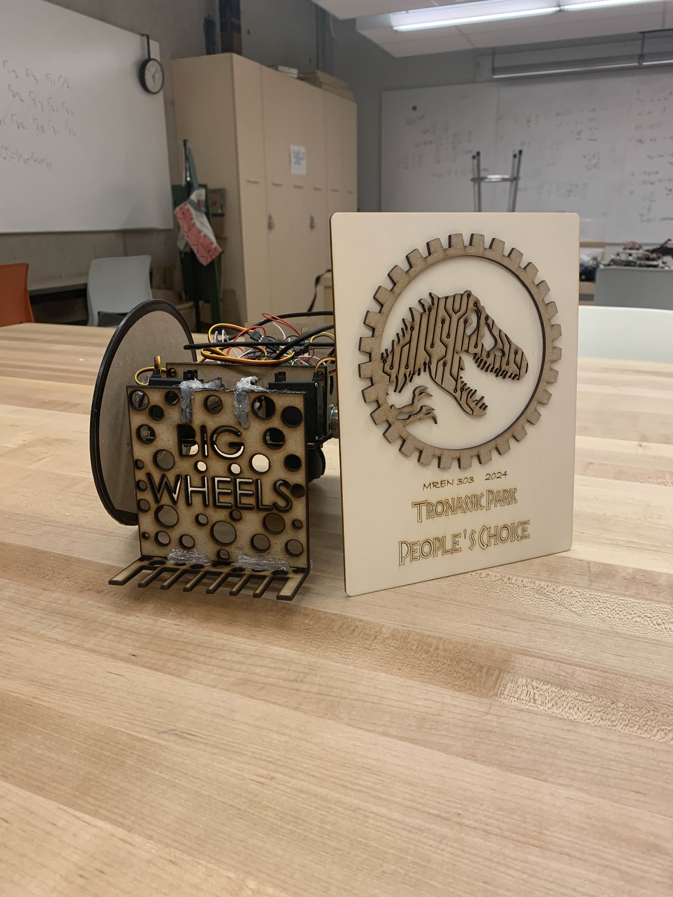
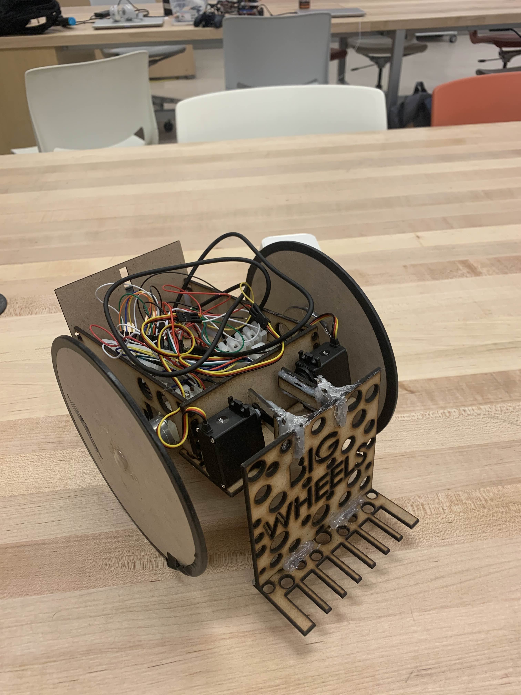
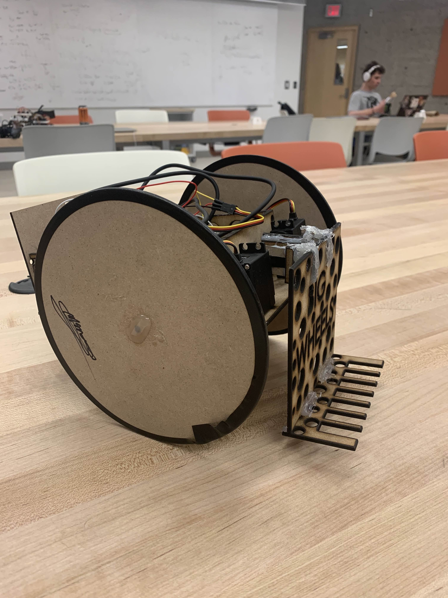
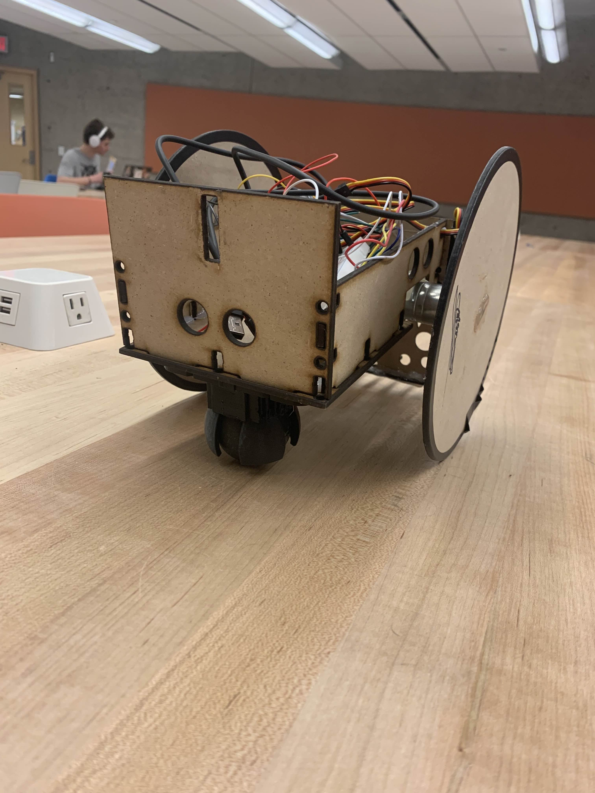

# 🦖 Jurassic Rescue Robot — Autonomous & Manual Rescue Challenge

> 🏆 **Winner – People's Choice Award**  
> MREN 303 – “Tronassic Park” Robotics Challenge (2024)

**A semester-long robotics project developed during my Mechatronics & Robotics Engineering coursework at Queen's University.**  
We designed, prototyped, and iterated a robot for a Jurassic Park-themed challenge. The robot’s mission was to autonomously press a button to open a gate and manually rescue a doll. Corralling dinosaur figures was a bonus objective.

---

## 🎯 Mission Objectives

- 🚪 **Autonomously press a button** to open a gate (no line-following allowed)
- 🧸 **Manually rescue a doll** from a pit and deliver to a helipad
- 🦕 **Corral dinosaurs** into a cage during manual mode (bonus points)

---

## 🔧 Constraints

| Constraint         | Details                                                  |
|-------------------|-----------------------------------------------------------|
| Motors            | 3 servo motors max                                        |
| Microcontroller   | Raspberry Pi Pico                                         |
| Materials         | Limited 3D printing, no pre-built chassis or wheels       |
| Tools             | Laser cutting, cardboard prototyping, SolidWorks CAD      |

---

## 🧠 Our Approach

We ran 5 Scrum-based design rounds. Each round included sprint planning, mechanical/electrical development, integration, and team reflection.

### 🧪 Key Technical Highlights

- Designed and tested multiple claw & lifting mechanisms
- Created electrical schematic + power budget
- Developed closed-loop motor feedback using encoders + PID
- Integrated joystick control and switching between manual/autonomous modes
- Used ultrasonic sensors to plan autonomous gate navigation
- Iterated wheels and chassis from cardboard → laser cut → 3D printed

---

## ⚙️ Tools & Tech Used

| Area         | Tools / Languages                 |
|--------------|-----------------------------------|
| CAD          | SolidWorks                        |
| Microcontroller | Raspberry Pi Pico (MicroPython) |
| Sensors      | Ultrasonic distance sensors       |
| Control      | Gamepad joystick + encoder logic  |
| Prototyping  | Cardboard, laser cutting, 3D printing |
| Planning     | Scrum, FRDPARRC, Risk Matrices    |

---

## 📁 Repository Structure

```
jurassic-rescue-robot/
├── README.md                 # This file
├── code/
│   └── pico_control.py       # Motor control, PID, encoder integration
├── docs/
│   └── final_report.md       # Full GitLab design reflections
├── images/
│   ├── award_robot.jpg
│   ├── robot_front.jpg
│   ├── robot_back.jpg
│   └── robot_side.jpg
├── design/
│   └── laser_cut_parts.dxf   # Fabrication-ready part files
```

---

## 📸 Photos

**🏆 People's Choice Award Winner — Final Robot Design**



**📐 Front View**  


**🔧 Side View**  


**🔙 Back View**  


---

## 📚 What I Learned

- How to take a design from **concept to functional prototype** under real constraints  
- How to apply **servo control, sensors, and feedback systems** in a robotic platform  
- How to balance **team coordination, documentation, and rapid prototyping**  
- The importance of **fit, tolerance, and mechanical simplicity** in physical builds

---

## 🫂 Acknowledgements

Project completed as part of MREN courses at Queen’s University.  
Big thanks to Kaitlyn (teammate), course instructors, and lab techs for support.

---

## 📫 Contact

Built by [Mousa Pirzada](https://www.linkedin.com/in/mousa-pirzada/)  
Email: 20mup@queensu.ca
