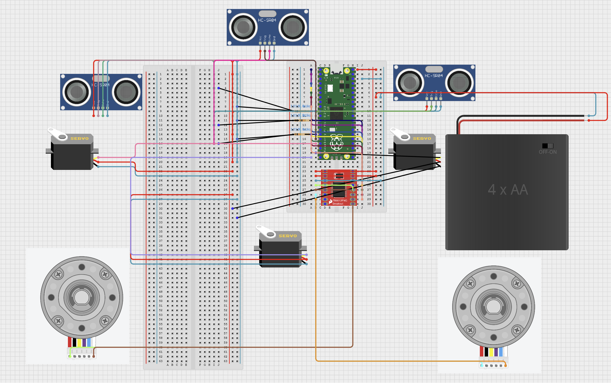
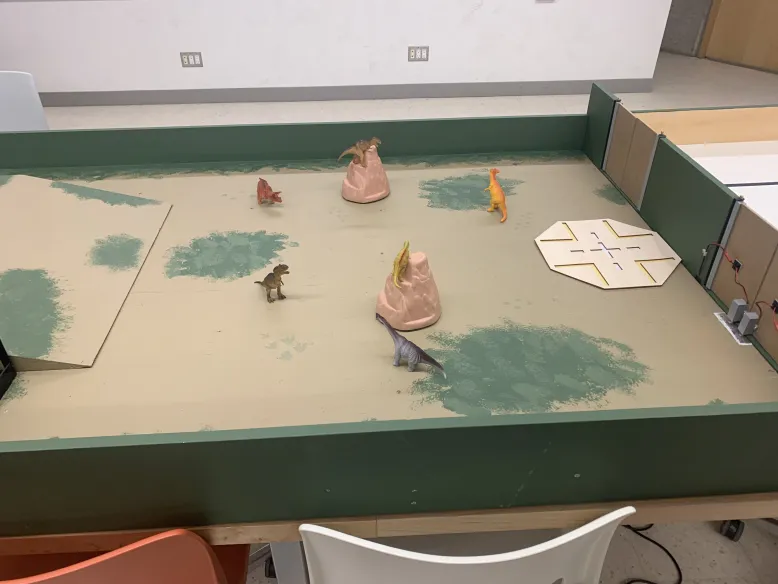

# 🦖 Jurassic Rescue Robot

A semi-autonomous rescue robot developed for the **MREN 303 2024 Tronassic Park Competition** at Queen’s University. Designed to traverse a gameboard, press a gate-opening button autonomously, and manually retrieve a "dinosaur" figure under strict mechanical, electrical, and coding constraints.

---

## 🏆 Awards

> 🥇 **People’s Choice Award**  
> Chosen by peers and faculty for outstanding design and implementation.

---

## 🚀 Project Highlights

- Autonomous navigation using ultrasonic sensors to press a physical button.
- Manual override via joystick-based control system.
- Energy-efficient power management using voltage dividers.
- Fully custom mechanical design built from laser-cut and 3D printed parts.
- Modular codebase split across Arduino and Pico W boards.

---

## 📁 Repository Structure

| Folder | Description |
|--------|-------------|
| `code/` | Full source code for robot control (Pico + Arduino). |
| `design/` | CAD files (`.SLDPRT`, `.STL`, `.DXF`) for all robot parts. |
| `images/` | Showcase images, schematics, and gameplay photos. |
| `docs/` | Final technical report and detailed documentation. |

---

## 🔧 Technologies Used

- **Hardware:** Raspberry Pi Pico W, Arduino-compatible controller, DC encoder motors, ultrasonic sensors, voltage dividers, joysticks.
- **Software:** C++, MicroPython, SolidWorks, laser cutting, 3D printing.
- **Tools:** OnShape, Git, GitHub, VS Code.

---

## 📸 Gallery

| Front | Side | Back |
|-------|------|------|
|  |  |  |

| Award | Circuit | Gameboard |
|-------|---------|-----------|
|  |  |  |

---

## 📄 Documentation

The full design process, task breakdowns, planning sprints, and retrospectives can be found in [`docs/final_report.md`](docs/final_report.md).

---

## 🤝 Team Contributions

- **Mousa Pirzada**: Lead programmer (Pico W), encoder control, closed-loop motor feedback, system integration.
- **Kaitlyn Johnston**: Electrical schematic design, CAD modeling, laser cutting, system assembly.

---

## 🧠 Lessons Learned

- Tighter tolerances on chassis holes prevent slippage.
- Autonomous mode testing requires iterative debugging under gameboard conditions.
- Coordinated CAD + electronics planning drastically reduced late-stage design issues.

---

## 📬 Feedback & Contact

Have questions or want to build your own version? Reach out via GitHub or open an Issue.

---

> _Built with gears, wires, and the spirit of Jurassic Park._ 🦕

